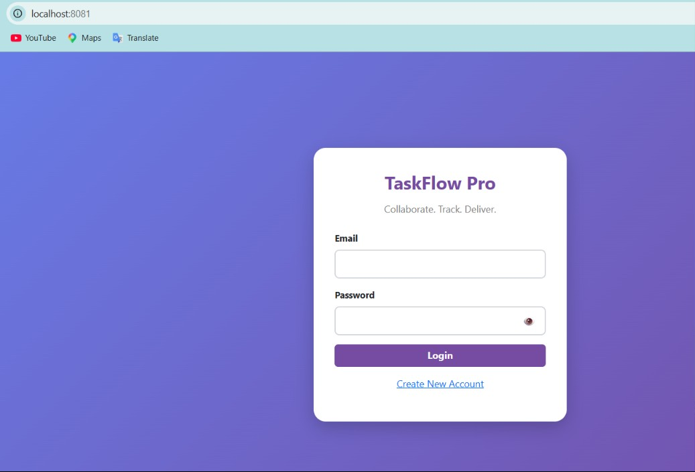
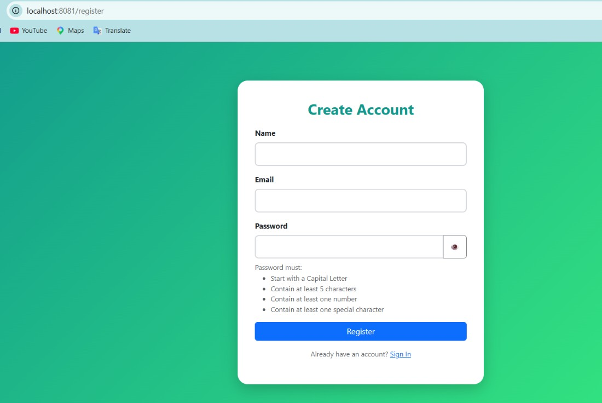
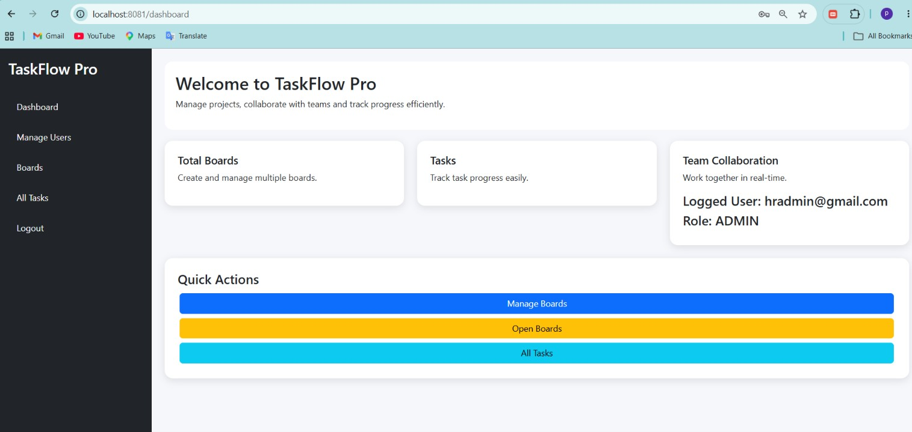
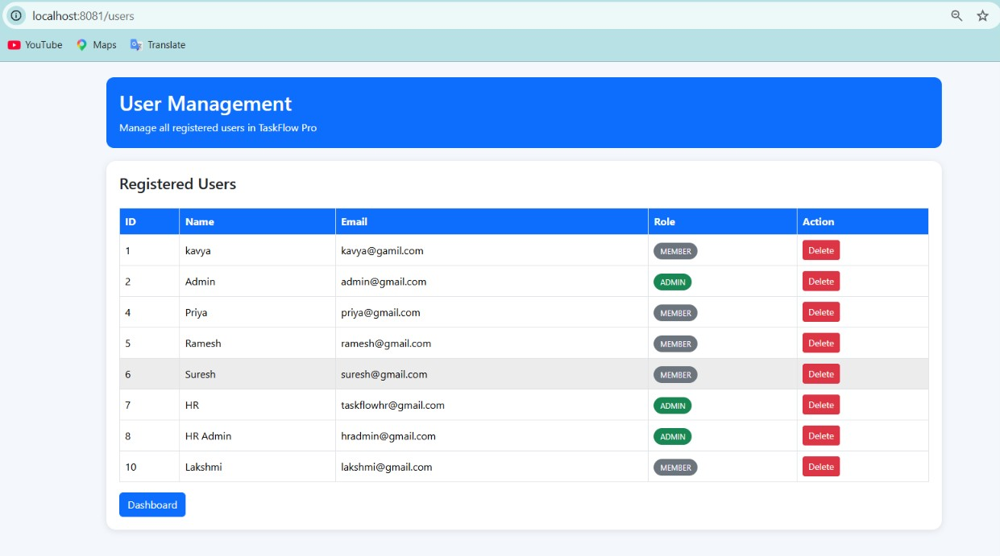
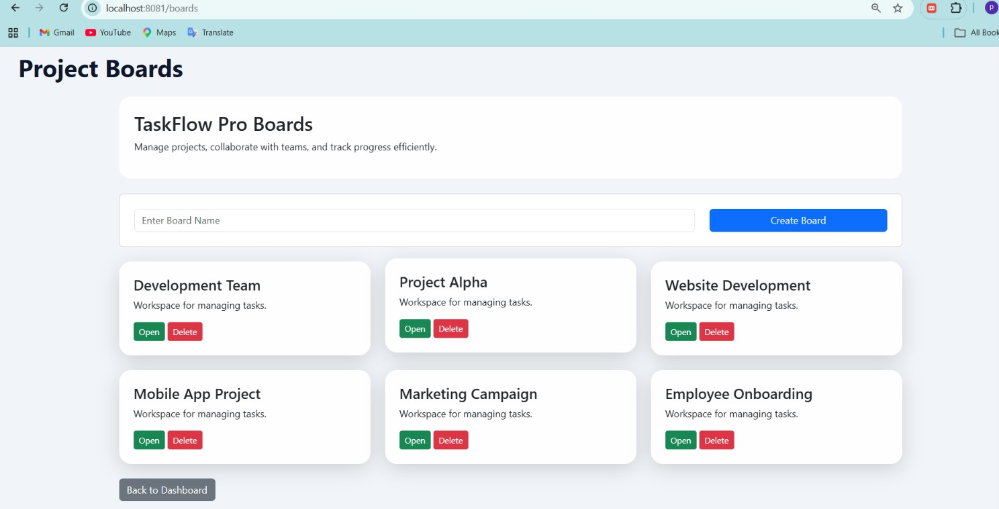
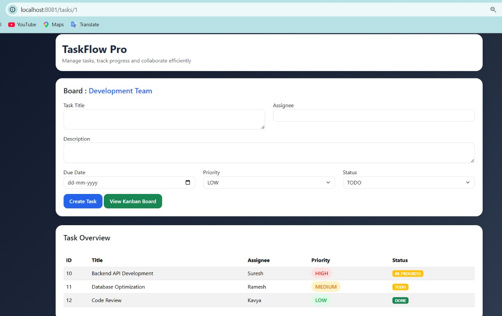
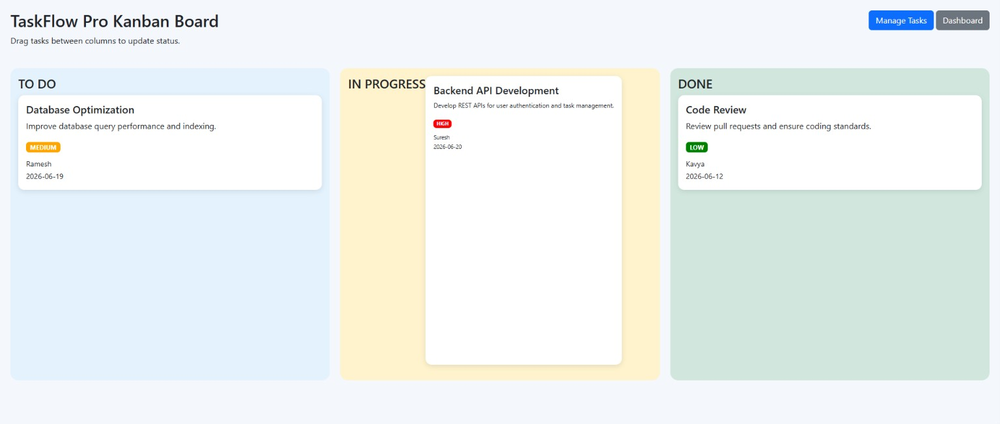
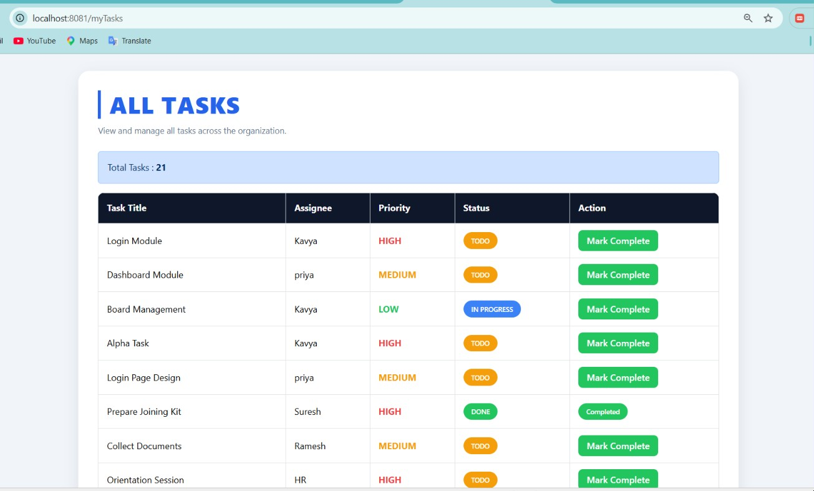
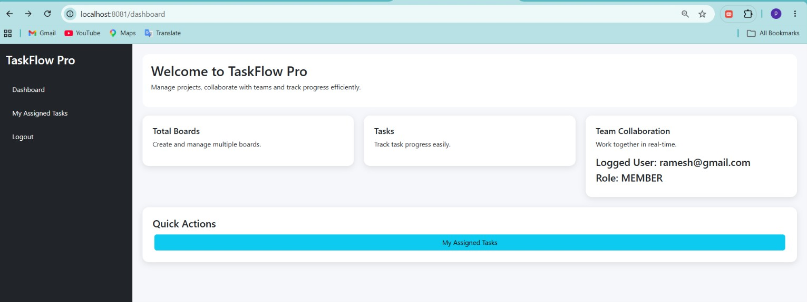
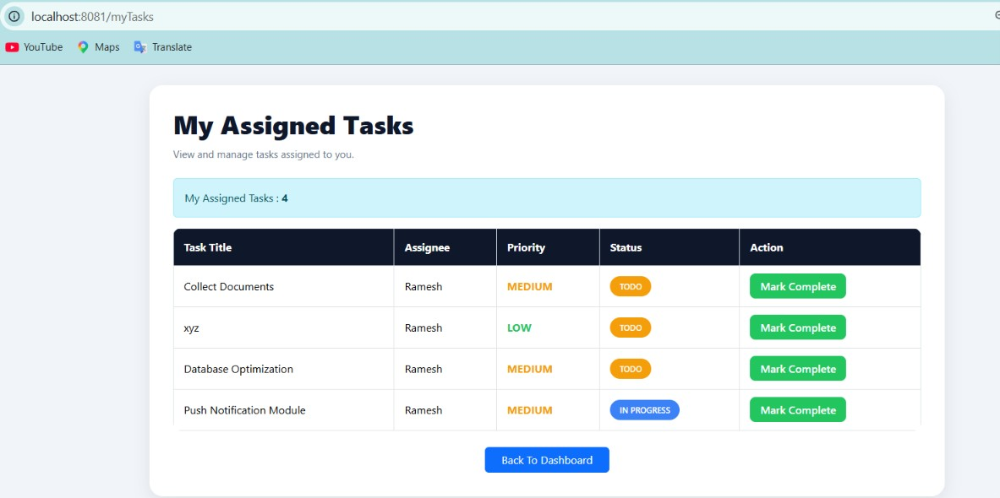

# TaskFlow Pro - Multi User Task Management System

## Overview

TaskFlow Pro is a full-stack web application inspired by Trello that helps teams organize projects, assign tasks, and track project progress efficiently.

The application supports multiple users, board management, task assignment, Kanban workflow management, and role-based access control with separate Admin and Member functionalities.

---

## Features

* User Registration and Login
* Session-Based Authentication
* Board Creation and Management
* Task Creation and Assignment
* Due Date and Priority Management
* Kanban Board (To Do, In Progress, Done)
* Drag and Drop Task Movement
* Near Real-Time Updates using Polling
* Role-Based Access Control
* MySQL Database Integration

---

## User Roles

### Admin

* Manage Users
* Create and Manage Boards
* Create and Assign Tasks
* View All Tasks
* Monitor Team Progress

### Member

* View Assigned Tasks
* Update Task Status
* Mark Tasks as Completed
* Track Assigned Work

---

## Technologies Used

### Backend

* Java 21
* Spring Boot
* Spring Data JPA
* Hibernate

### Frontend

* JSP
* HTML
* CSS
* Bootstrap 5
* JavaScript

### Database

* MySQL

### Development Tools

* Eclipse IDE
* Maven
* Git
* GitHub

---

## Project Structure

```text
taskflowpro
│
├── src
│   ├── main
│   │   ├── java
│   │   │   ├── controller
│   │   │   ├── entity
│   │   │   ├── repository
│   │   │   └── service
│   │   ├── resources
│   │   │   └── application.properties
│   │   └── webapp
│   │       ├── login.jsp
│   │       ├── register.jsp
│   │       ├── dashboard.jsp
│   │       ├── boards.jsp
│   │       ├── tasks.jsp
│   │       ├── kanban.jsp
│   │       ├── myTasks.jsp
│   │       └── users.jsp
│   └── test
│
├── screenshots
├── pom.xml
└── README.md
```

---

## Setup Instructions

### 1. Clone the Repository

```bash
git clone https://github.com/pkavyamandira/azentrix-fullstack-task2.git
```

### 2. Create a MySQL Database

```sql
CREATE DATABASE taskflow;
```

### 3. Configure Database Credentials

Update the database credentials in:

```text
src/main/resources/application.properties
```

Example:

```properties
spring.datasource.url=jdbc:mysql://localhost:3306/taskflow
spring.datasource.username=root
spring.datasource.password=your_password
```

### 4. Run the Application

Run the Spring Boot application by executing:

```text
TaskflowproApplication.java
```

### 5. Open the Application

```text
http://localhost:8081
```

---

## Screenshots

### Login Page



### Registration Page



### Admin Dashboard



### Manage Users



### Boards Management



### Create Task



### Kanban Board



### Admin - All Tasks



### Member Dashboard



### Member Assigned Tasks



---

## Demo Video

Loom Recording

https://www.loom.com/share/cdc599cf889d4746a735232dd20d67d9

---

## Future Enhancements

* JWT Authentication
* Email Notifications
* File Attachments
* Activity Logs
* Team Analytics Dashboard
* WebSocket-Based Real-Time Collaboration

---

## Author

**Kavya Mandira Pendyala**

B.Tech, Computer Science and Engineering (Cyber Security)

GitHub: https://github.com/pkavyamandira
